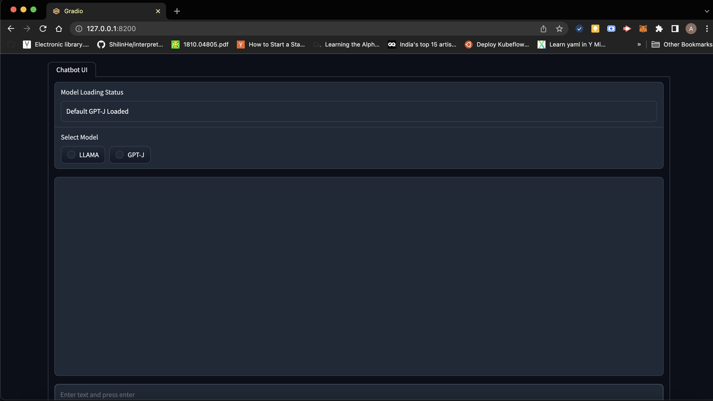
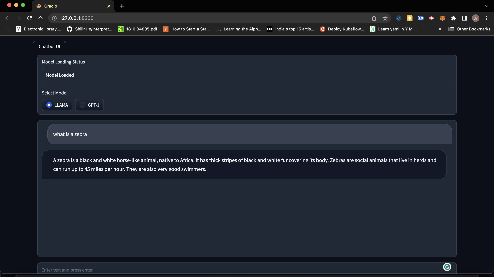

# LLM-Chatbot

The repo contains a chatbot built using a dockerized LLM Model. We provide a UI that can help use the bot.

## Repo Organization
```
.
├── chatbot                       # The backend API of the model of the application
├───── src
├────────── config.yaml       
├────────── main.py           
├────────── model.py
├───── model
├───── Dockerfile
├───── requirements.txt
├── web                           # The frontend application of the application
├───── app.py
├── build_run.sh                  # script to the solution
├── docker-compose.yaml      
├── README.md     
└── requirements.txt  
```
 
## Steps to install dependencies with Docker

- create a virtual environment `python3 -m venv chatbot_ui_env`
- Activate the venv `source chatbot_ui_env/bin/activate`
- Install the dependencies for Gradio `pip install -r requirements.txt`

## Steps to install dependencies without Docker
> In addition to the above steps run the following steps as well
- Go the the chatbot directory `cd chatbot/`
- Install the API requirements `pip install -r requirements.txt`

## Steps to run the system with docker

- Run the script to run the application `bash build_run.sh`

## Steps to run the system without docker

- Navigate to src directory `cd chatbot/src/`
- Run the FastAPI `uvicorn main:app –port 8100:8100 –reload`
- In a different terminal open the web directory `cd web/`
- Run the Gradio Application `gradio app.py`

## UI Sample




## Models used

- LLAMA 7B: Using [llama.cpp](https://github.com/abetlen/llama-cpp-python)
- GPT-J: Using [GPT4All](https://github.com/nomic-ai/gpt4all)

> GPT-J model is faster than LLAMA, but provides the results aren't as good as compared to LLAMA. For systems with resource constraints using GPT-J should be preferred. 

# Documentation
[Documentation](assets/Documentation.pdf)
